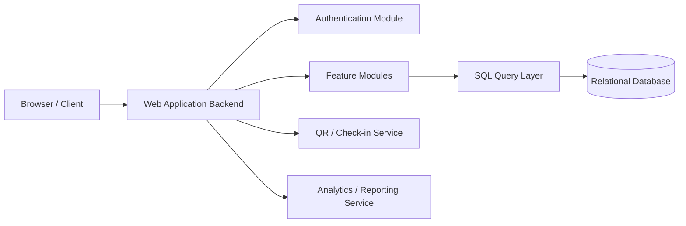
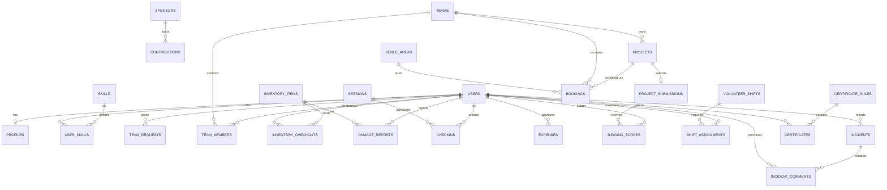

# System Architecture Document

## Project Title
**Hackathon Operations Hub**

---

# 1. Architecture Overview

The system follows a **3-tier web architecture**:

1. **Presentation Layer**  
   - HTML, CSS, JavaScript
   - Dashboards for admin, organizer, participant, judge, volunteer

2. **Application Layer**  
   - Backend server
   - Authentication and authorization
   - Feature modules
   - Business rules
   - Direct SQL execution

3. **Database Layer**  
   - Relational DBMS
   - Normalized tables
   - Constraints, triggers/views if needed
   - No ORM

---

## High-Level Architecture Diagram



---

# 2. Recommended Technology Stack

You may use any backend language and RDBMS, but a simple and strong choice is:

| Layer | Recommended Technology |
|---|---|
| Backend | Python Flask / FastAPI |
| Database | PostgreSQL or MySQL |
| Frontend | HTML, CSS, JavaScript, Bootstrap |
| Charts | Chart.js |
| QR | QR code generation library |
| SQL Access | DB driver only, **no ORM** |

### Example stack
- **Backend:** Python Flask
- **Database:** PostgreSQL
- **SQL Driver:** `psycopg` / `psycopg2`
- **Frontend:** Jinja templates + Bootstrap + JavaScript

> Since your requirement says **ANY backend language** and **ANY RDBMS**, this architecture can also be implemented with PHP + MySQL, Node.js + PostgreSQL, Java + MySQL, etc.

---

# 3. No-ORM Requirement

The application must not use ORM tools such as:
- SQLAlchemy ORM
- Hibernate
- Eloquent ORM
- Sequelize ORM
- Entity Framework ORM

Instead, use:
- raw SQL queries
- parameterized queries
- stored procedures/functions if desired
- views where useful

### Example data access pattern

```python
def fetch_one(query, params=None):
    with get_db_connection() as conn:
        with conn.cursor() as cur:
            cur.execute(query, params or ())
            return cur.fetchone()
```

This keeps the project compliant with the “no ORM” requirement.

---

# 4. Module Structure

| Module | Main Responsibility |
|---|---|
| Auth Module | Signup, login, logout, roles |
| Inventory Module | Hardware tracking and checkouts |
| Team Module | Solo participant matching and team formation |
| Schedule Module | Itinerary and check-ins |
| Finance Module | Sponsorship and expenses |
| Certificate Module | Eligibility and certificate records |
| Venue Module | Booth/table/room booking |
| Project Module | Project submissions and judging |
| Volunteer Module | Shift management |
| Incident Module | Incident reports and analytics |

---

# 5. Suggested Folder Structure

```text
project-root/
│
├── README.md
├── docs/
│   ├── PRD.md
│   ├── ARCHITECTURE.md
│   ├── feature-list.docx
│   ├── final-report.docx
│   └── diagrams/
│       ├── er-diagram.png
│       ├── eer-diagram.png
│       └── schema-diagram.png
│
├── database/
│   ├── schema.sql
│   ├── seed.sql
│   └── procedures.sql
│
├── backend/
│   ├── app.py
│   ├── config.py
│   ├── db.py
│   ├── auth/
│   ├── inventory/
│   ├── teams/
│   ├── schedule/
│   ├── finance/
│   ├── certificates/
│   ├── venue/
│   ├── projects/
│   ├── volunteers/
│   └── incidents/
│
└── frontend/
    ├── templates/
    ├── static/
    └── assets/
```

---

# 6. User Roles and Access Model

## Roles

| Role | Permissions |
|---|---|
| Admin | Full access |
| Organizer | Manage event modules |
| Participant | View schedule, join teams, submit projects, report incidents |
| Judge | View assigned submissions and enter scores |
| Volunteer | View and join shifts |

## Authorization Approach
- Store role in `users` table
- Validate role on protected routes
- Use session-based or token-based authentication

> Login / Logout / Signup are system utilities and not counted among the 9 features.

---

# 7. Database Design

The database should be normalized, relational, and constraint-driven.

## Core Entities

### User and Participant Management
- users
- profiles
- skills
- user_skills
- team_requests
- teams
- team_members

### Inventory
- inventory_items
- inventory_checkouts
- damage_reports

### Schedule and Check-in
- sessions
- checkins

### Finance
- sponsors
- contributions
- expenses

### Certificates
- certificate_rules
- certificates

### Venue
- venue_areas
- bookings

### Projects and Judging
- projects
- project_submissions
- judging_scores

### Volunteers
- volunteer_shifts
- shift_assignments

### Incidents and Feedback
- incidents
- incident_comments
- feedback_forms
- feedback_questions
- feedback_responses
- feedback_answers

---

# 8. ER / EER Diagram

You can render this Mermaid diagram and export it as PNG for submission.



## EER Note
If you want a formal EER diagram:
- Use `USERS` as a supertype
- Use role subtypes:
  - Participant
  - Organizer
  - Judge
  - Volunteer
  - Admin

In implementation, a single `users` table with a `role` column is acceptable and simpler.

---

# 9. Database Schema Diagram

A schema-oriented view can be represented like this:

```mermaid
classDiagram
    class users {
        bigint id PK
        varchar email
        varchar password_hash
        varchar full_name
        varchar role
        boolean is_active
        timestamptz created_at
    }

    class inventory_items {
        bigint id PK
        varchar name
        varchar category
        varchar serial_number
        varchar condition
        varchar status
        int quantity_total
        int quantity_available
        varchar location
    }

    class inventory_checkouts {
        bigint id PK
        bigint item_id FK
        bigint borrower_id FK
        bigint checked_out_by FK
        timestamptz checkout_at
        timestamptz due_at
        timestamptz returned_at
        varchar status
    }

    class sessions {
        bigint id PK
        varchar title
        varchar session_type
        timestamptz start_at
        timestamptz end_at
        varchar status
    }

    class checkins {
        bigint id PK
        bigint user_id FK
        bigint session_id FK
        varchar method
        timestamptz checked_at
    }

    class teams {
        bigint id PK
        varchar name
        int capacity
        varchar status
    }

    class team_members {
        bigint team_id FK
        bigint user_id FK
        varchar member_role
    }

    class venue_areas {
        bigint id PK
        varchar name
        varchar area_type
        int capacity
    }

    class bookings {
        bigint id PK
        bigint area_id FK
        bigint team_id FK
        bigint project_id FK
        timestamptz start_at
        timestamptz end_at
        varchar status
    }

    class projects {
        bigint id PK
        bigint team_id FK
        varchar title
        varchar status
    }

    class project_submissions {
        bigint id PK
        bigint project_id FK
        varchar repo_url
        varchar submission_status
    }

    class judging_scores {
        bigint id PK
        bigint submission_id FK
        bigint judge_id FK
        int innovation
        int technical
        int presentation
        int impact
    }

    class volunteer_shifts {
        bigint id PK
        varchar title
        timestamptz start_at
        timestamptz end_at
        int capacity
    }

    class shift_assignments {
        bigint shift_id FK
        bigint user_id FK
        varchar status
    }

    class incidents {
        bigint id PK
        varchar title
        varchar severity
        varchar status
        bigint reported_by FK
    }

    users ||--o{ team_members
    teams ||--o{ team_members
    users ||--o{ inventory_checkouts
    inventory_items ||--o{ inventory_checkouts
    users ||--o{ checkins
    sessions ||--o{ checkins
    teams ||--o{ projects
    projects ||--o| project_submissions
    project_submissions ||--o{ judging_scores
    users ||--o{ judging_scores
    venue_areas ||--o{ bookings
    teams ||--o{ bookings
    volunteer_shifts ||--o{ shift_assignments
    users ||--o{ shift_assignments
    users ||--o{ incidents
```

---

# 10. Sample Relational Schema

Below is a practical SQL schema. You can adapt it to your chosen RDBMS.

## Users and Profiles

```sql
CREATE TABLE users (
    id BIGSERIAL PRIMARY KEY,
    email VARCHAR(255) UNIQUE NOT NULL,
    password_hash VARCHAR(255) NOT NULL,
    full_name VARCHAR(150) NOT NULL,
    role VARCHAR(20) NOT NULL DEFAULT 'participant'
        CHECK (role IN ('admin', 'organizer', 'participant', 'judge', 'volunteer')),
    is_active BOOLEAN NOT NULL DEFAULT TRUE,
    created_at TIMESTAMPTZ NOT NULL DEFAULT NOW()
);

CREATE TABLE profiles (
    user_id BIGINT PRIMARY KEY REFERENCES users(id) ON DELETE CASCADE,
    bio TEXT,
    experience_level VARCHAR(20)
        CHECK (experience_level IN ('beginner', 'intermediate', 'advanced')),
    github_url VARCHAR(255),
    portfolio_url VARCHAR(255),
    seeking_team BOOLEAN NOT NULL DEFAULT FALSE,
    updated_at TIMESTAMPTZ NOT NULL DEFAULT NOW()
);

CREATE TABLE skills (
    id BIGSERIAL PRIMARY KEY,
    name VARCHAR(100) UNIQUE NOT NULL
);

CREATE TABLE user_skills (
    user_id BIGINT REFERENCES users(id) ON DELETE CASCADE,
    skill_id BIGINT REFERENCES skills(id) ON DELETE CASCADE,
    PRIMARY KEY (user_id, skill_id)
);
```

## Team Formation

```sql
CREATE TABLE team_requests (
    id BIGSERIAL PRIMARY KEY,
    user_id BIGINT UNIQUE NOT NULL REFERENCES users(id) ON DELETE CASCADE,
    tech_stack TEXT NOT NULL,
    goals TEXT,
    desired_team_size INT NOT NULL DEFAULT 4 CHECK (desired_team_size BETWEEN 2 AND 10),
    status VARCHAR(20) NOT NULL DEFAULT 'open'
        CHECK (status IN ('open', 'matched', 'cancelled')),
    created_at TIMESTAMPTZ NOT NULL DEFAULT NOW()
);

CREATE TABLE teams (
    id BIGSERIAL PRIMARY KEY,
    name VARCHAR(120) UNIQUE NOT NULL,
    theme VARCHAR(150),
    capacity INT NOT NULL DEFAULT 4 CHECK (capacity BETWEEN 1 AND 10),
    status VARCHAR(20) NOT NULL DEFAULT 'open'
        CHECK (status IN ('open', 'locked', 'disqualified')),
    created_by BIGINT REFERENCES users(id),
    created_at TIMESTAMPTZ NOT NULL DEFAULT NOW()
);

CREATE TABLE team_members (
    team_id BIGINT REFERENCES teams(id) ON DELETE CASCADE,
    user_id BIGINT REFERENCES users(id) ON DELETE CASCADE,
    member_role VARCHAR(50) NOT NULL DEFAULT 'member',
    joined_at TIMESTAMPTZ NOT NULL DEFAULT NOW(),
    PRIMARY KEY (team_id, user_id)
);
```

## Hardware Inventory

```sql
CREATE TABLE inventory_items (
    id BIGSERIAL PRIMARY KEY,
    name VARCHAR(150) NOT NULL,
    category VARCHAR(80) NOT NULL,
    serial_number VARCHAR(120) UNIQUE,
    description TEXT,
    condition VARCHAR(20) NOT NULL DEFAULT 'good'
        CHECK (condition IN ('new', 'good', 'fair', 'damaged', 'retired')),
    status VARCHAR(20) NOT NULL DEFAULT 'available'
        CHECK (status IN ('available', 'checked_out', 'maintenance', 'retired')),
    quantity_total INT NOT NULL CHECK (quantity_total >= 0),
    quantity_available INT NOT NULL CHECK (quantity_available >= 0),
    location VARCHAR(120),
    qr_code TEXT,
    created_at TIMESTAMPTZ NOT NULL DEFAULT NOW(),
    updated_at TIMESTAMPTZ NOT NULL DEFAULT NOW()
);

CREATE TABLE inventory_checkouts (
    id BIGSERIAL PRIMARY KEY,
    item_id BIGINT NOT NULL REFERENCES inventory_items(id),
    borrower_id BIGINT NOT NULL REFERENCES users(id),
    checked_out_by BIGINT NOT NULL REFERENCES users(id),
    checkout_at TIMESTAMPTZ NOT NULL DEFAULT NOW(),
    due_at TIMESTAMPTZ NOT NULL,
    returned_at TIMESTAMPTZ,
    status VARCHAR(20) NOT NULL DEFAULT 'active'
        CHECK (status IN ('active', 'returned', 'overdue', 'damaged', 'lost')),
    notes TEXT,
    CHECK (returned_at IS NULL OR returned_at >= checkout_at)
);

CREATE TABLE damage_reports (
    id BIGSERIAL PRIMARY KEY,
    item_id BIGINT NOT NULL REFERENCES inventory_items(id),
    checkout_id BIGINT REFERENCES inventory_checkouts(id),
    reported_by BIGINT NOT NULL REFERENCES users(id),
    severity VARCHAR(20) NOT NULL CHECK (severity IN ('minor', 'major', 'critical')),
    description TEXT NOT NULL,
    status VARCHAR(20) NOT NULL DEFAULT 'open'
        CHECK (status IN ('open', 'repairing', 'resolved', 'retired')),
    created_at TIMESTAMPTZ NOT NULL DEFAULT NOW()
);
```

## Schedule and Check-in

```sql
CREATE TABLE sessions (
    id BIGSERIAL PRIMARY KEY,
    title VARCHAR(180) NOT NULL,
    session_type VARCHAR(40) NOT NULL
        CHECK (session_type IN ('keynote', 'workshop', 'mentoring', 'demo', 'break', 'judging', 'other')),
    start_at TIMESTAMPTZ NOT NULL,
    end_at TIMESTAMPTZ NOT NULL,
    venue_area VARCHAR(120),
    capacity INT CHECK (capacity IS NULL OR capacity >= 0),
    status VARCHAR(20) NOT NULL DEFAULT 'scheduled'
        CHECK (status IN ('scheduled', 'live', 'cancelled', 'completed')),
    CHECK (end_at > start_at)
);

CREATE TABLE checkins (
    id BIGSERIAL PRIMARY KEY,
    user_id BIGINT NOT NULL REFERENCES users(id),
    session_id BIGINT NOT NULL REFERENCES sessions(id),
    method VARCHAR(10) NOT NULL DEFAULT 'manual' CHECK (method IN ('qr', 'manual')),
    checked_at TIMESTAMPTZ NOT NULL DEFAULT NOW(),
    UNIQUE (user_id, session_id)
);
```

## Budget and Sponsorship

```sql
CREATE TABLE sponsors (
    id BIGSERIAL PRIMARY KEY,
    name VARCHAR(150) UNIQUE NOT NULL,
    tier VARCHAR(50) CHECK (tier IN ('title', 'gold', 'silver', 'bronze', 'partner')),
    contact_email VARCHAR(255),
    contact_phone VARCHAR(30),
    notes TEXT,
    created_at TIMESTAMPTZ NOT NULL DEFAULT NOW()
);

CREATE TABLE contributions (
    id BIGSERIAL PRIMARY KEY,
    sponsor_id BIGINT NOT NULL REFERENCES sponsors(id) ON DELETE CASCADE,
    amount NUMERIC(12,2) NOT NULL CHECK (amount >= 0),
    contribution_type VARCHAR(20) NOT NULL DEFAULT 'cash' CHECK (contribution_type IN ('cash', 'in-kind')),
    status VARCHAR(20) NOT NULL DEFAULT 'pledged'
        CHECK (status IN ('pledged', 'received', 'cancelled')),
    received_at TIMESTAMPTZ,
    notes TEXT,
    created_at TIMESTAMPTZ NOT NULL DEFAULT NOW()
);

CREATE TABLE expenses (
    id BIGSERIAL PRIMARY KEY,
    category VARCHAR(40) NOT NULL
        CHECK (category IN ('venue', 'catering', 'swag', 'equipment', 'logistics', 'other')),
    amount NUMERIC(12,2) NOT NULL CHECK (amount >= 0),
    spent_at TIMESTAMPTZ NOT NULL,
    description TEXT,
    status VARCHAR(20) NOT NULL DEFAULT 'draft'
        CHECK (status IN ('draft', 'submitted', 'approved', 'rejected')),
    approved_by BIGINT REFERENCES users(id),
    created_at TIMESTAMPTZ NOT NULL DEFAULT NOW()
);
```

## Certificates

```sql
CREATE TABLE certificate_rules (
    id BIGSERIAL PRIMARY KEY,
    min_session_checkins INT NOT NULL DEFAULT 3 CHECK (min_session_checkins >= 0),
    require_project_submission BOOLEAN NOT NULL DEFAULT FALSE,
    min_project_score NUMERIC(5,2),
    active BOOLEAN NOT NULL DEFAULT TRUE,
    updated_at TIMESTAMPTZ NOT NULL DEFAULT NOW()
);

CREATE TABLE certificates (
    id BIGSERIAL PRIMARY KEY,
    user_id BIGINT NOT NULL REFERENCES users(id) ON DELETE CASCADE,
    verification_code VARCHAR(100) UNIQUE NOT NULL,
    status VARCHAR(20) NOT NULL DEFAULT 'eligible'
        CHECK (status IN ('eligible', 'issued', 'revoked')),
    issued_at TIMESTAMPTZ,
    reason TEXT,
    created_at TIMESTAMPTZ NOT NULL DEFAULT NOW()
);
```

## Venue and Logistics

```sql
CREATE TABLE venue_areas (
    id BIGSERIAL PRIMARY KEY,
    name VARCHAR(120) UNIQUE NOT NULL,
    area_type VARCHAR(20) NOT NULL
        CHECK (area_type IN ('table', 'booth', 'room', 'stage', 'lab', 'exhibit')),
    capacity INT NOT NULL DEFAULT 2 CHECK (capacity >= 0),
    map_location VARCHAR(120),
    is_bookable BOOLEAN NOT NULL DEFAULT TRUE,
    created_at TIMESTAMPTZ NOT NULL DEFAULT NOW()
);
```

## Projects and Judging

```sql
CREATE TABLE projects (
    id BIGSERIAL PRIMARY KEY,
    team_id BIGINT UNIQUE REFERENCES teams(id) ON DELETE CASCADE,
    title VARCHAR(180) NOT NULL,
    problem_statement TEXT,
    tech_stack TEXT,
    status VARCHAR(20) NOT NULL DEFAULT 'idea'
        CHECK (status IN ('idea', 'active', 'submitted', 'disqualified')),
    created_at TIMESTAMPTZ NOT NULL DEFAULT NOW()
);

CREATE TABLE bookings (
    id BIGSERIAL PRIMARY KEY,
    area_id BIGINT NOT NULL REFERENCES venue_areas(id) ON DELETE CASCADE,
    team_id BIGINT REFERENCES teams(id) ON DELETE SET NULL,
    project_id BIGINT REFERENCES projects(id) ON DELETE SET NULL,
    purpose VARCHAR(180),
    start_at TIMESTAMPTZ NOT NULL,
    end_at TIMESTAMPTZ NOT NULL,
    status VARCHAR(20) NOT NULL DEFAULT 'confirmed'
        CHECK (status IN ('tentative', 'confirmed', 'cancelled', 'completed')),
    assigned_by BIGINT REFERENCES users(id),
    created_at TIMESTAMPTZ NOT NULL DEFAULT NOW(),
    CHECK (end_at > start_at),
    CHECK (team_id IS NOT NULL OR project_id IS NOT NULL OR purpose IS NOT NULL)
);

CREATE TABLE project_submissions (
    id BIGSERIAL PRIMARY KEY,
    project_id BIGINT NOT NULL REFERENCES projects(id) ON DELETE CASCADE,
    repo_url VARCHAR(255),
    demo_url VARCHAR(255),
    video_url VARCHAR(255),
    submission_status VARCHAR(20) NOT NULL DEFAULT 'draft'
        CHECK (submission_status IN ('draft', 'submitted', 'locked')),
    submitted_at TIMESTAMPTZ,
    created_at TIMESTAMPTZ NOT NULL DEFAULT NOW()
);

CREATE TABLE judging_scores (
    id BIGSERIAL PRIMARY KEY,
    submission_id BIGINT NOT NULL REFERENCES project_submissions(id) ON DELETE CASCADE,
    judge_id BIGINT NOT NULL REFERENCES users(id),
    innovation INT NOT NULL CHECK (innovation BETWEEN 0 AND 10),
    technical INT NOT NULL CHECK (technical BETWEEN 0 AND 10),
    presentation INT NOT NULL CHECK (presentation BETWEEN 0 AND 10),
    impact INT NOT NULL CHECK (impact BETWEEN 0 AND 10),
    comments TEXT,
    created_at TIMESTAMPTZ NOT NULL DEFAULT NOW(),
    UNIQUE (submission_id, judge_id)
);
```

## Volunteer Shifts

```sql
CREATE TABLE volunteer_shifts (
    id BIGSERIAL PRIMARY KEY,
    title VARCHAR(150) NOT NULL,
    area VARCHAR(120),
    start_at TIMESTAMPTZ NOT NULL,
    end_at TIMESTAMPTZ NOT NULL,
    capacity INT NOT NULL CHECK (capacity >= 1),
    required_skills TEXT,
    status VARCHAR(20) NOT NULL DEFAULT 'open'
        CHECK (status IN ('open', 'closed', 'cancelled')),
    CHECK (end_at > start_at)
);

CREATE TABLE shift_assignments (
    shift_id BIGINT REFERENCES volunteer_shifts(id) ON DELETE CASCADE,
    user_id BIGINT REFERENCES users(id) ON DELETE CASCADE,
    assigned_at TIMESTAMPTZ NOT NULL DEFAULT NOW(),
    checked_in_at TIMESTAMPTZ,
    status VARCHAR(20) NOT NULL DEFAULT 'assigned'
        CHECK (status IN ('assigned', 'checked_in', 'cancelled', 'completed')),
    PRIMARY KEY (shift_id, user_id)
);
```

## Incidents and Feedback

```sql
CREATE TABLE incidents (
    id BIGSERIAL PRIMARY KEY,
    title VARCHAR(180) NOT NULL,
    description TEXT NOT NULL,
    category VARCHAR(40) NOT NULL
        CHECK (category IN ('safety', 'hardware', 'network', 'conduct', 'logistics', 'other')),
    severity VARCHAR(20) NOT NULL
        CHECK (severity IN ('low', 'medium', 'high', 'critical')),
    status VARCHAR(20) NOT NULL DEFAULT 'open'
        CHECK (status IN ('open', 'in_progress', 'resolved', 'closed')),
    reported_by BIGINT NOT NULL REFERENCES users(id),
    assigned_to BIGINT REFERENCES users(id),
    resolved_at TIMESTAMPTZ,
    created_at TIMESTAMPTZ NOT NULL DEFAULT NOW()
);

CREATE TABLE incident_comments (
    id BIGSERIAL PRIMARY KEY,
    incident_id BIGINT NOT NULL REFERENCES incidents(id) ON DELETE CASCADE,
    user_id BIGINT NOT NULL REFERENCES users(id),
    comment TEXT NOT NULL,
    created_at TIMESTAMPTZ NOT NULL DEFAULT NOW()
);

CREATE TABLE feedback_forms (
    id BIGSERIAL PRIMARY KEY,
    title VARCHAR(180) NOT NULL,
    is_active BOOLEAN NOT NULL DEFAULT TRUE,
    created_at TIMESTAMPTZ NOT NULL DEFAULT NOW()
);

CREATE TABLE feedback_questions (
    id BIGSERIAL PRIMARY KEY,
    form_id BIGINT NOT NULL REFERENCES feedback_forms(id) ON DELETE CASCADE,
    label TEXT NOT NULL,
    question_type VARCHAR(20) NOT NULL CHECK (question_type IN ('rating', 'text', 'choice')),
    options TEXT
);

CREATE TABLE feedback_responses (
    id BIGSERIAL PRIMARY KEY,
    form_id BIGINT NOT NULL REFERENCES feedback_forms(id) ON DELETE CASCADE,
    user_id BIGINT NOT NULL REFERENCES users(id),
    submitted_at TIMESTAMPTZ NOT NULL DEFAULT NOW(),
    UNIQUE (form_id, user_id)
);

CREATE TABLE feedback_answers (
    response_id BIGINT NOT NULL REFERENCES feedback_responses(id) ON DELETE CASCADE,
    question_id BIGINT NOT NULL REFERENCES feedback_questions(id) ON DELETE CASCADE,
    rating INT CHECK (rating BETWEEN 1 AND 5),
    text_value TEXT,
    PRIMARY KEY (response_id, question_id)
);
```

---

# 11. Important Indexes

```sql
CREATE INDEX idx_inventory_item_status ON inventory_items(status);
CREATE INDEX idx_checkout_item_status ON inventory_checkouts(item_id, status);
CREATE INDEX idx_checkout_borrower ON inventory_checkouts(borrower_id);

CREATE INDEX idx_sessions_start ON sessions(start_at);
CREATE INDEX idx_checkins_user ON checkins(user_id);
CREATE INDEX idx_checkins_session ON checkins(session_id);

CREATE INDEX idx_bookings_area_time ON bookings(area_id, start_at, end_at);
CREATE INDEX idx_bookings_team ON bookings(team_id);

CREATE INDEX idx_projects_team ON projects(team_id);
CREATE INDEX idx_submission_status ON project_submissions(submission_status);
CREATE INDEX idx_scores_submission ON judging_scores(submission_id);

CREATE INDEX idx_shift_time ON volunteer_shifts(start_at, end_at);
CREATE INDEX idx_shift_assign_user ON shift_assignments(user_id);

CREATE INDEX idx_incidents_status ON incidents(status);
CREATE INDEX idx_incidents_severity ON incidents(severity);
```

---

# 12. Key SQL Operations

This section demonstrates that the system uses meaningful SQL logic and not only simple SELECT/INSERT.

---

## 12.1 Hardware Checkout Transaction

```sql
BEGIN;

UPDATE inventory_items
SET quantity_available = quantity_available - 1,
    updated_at = NOW()
WHERE id = %s
  AND quantity_available > 0;

INSERT INTO inventory_checkouts (
    item_id, borrower_id, checked_out_by, due_at, status
) VALUES (
    %s, %s, %s, %s, 'active'
);

COMMIT;
```

### Application Rule
If the UPDATE affects 0 rows, rollback and show “Item unavailable”.

---

## 12.2 Return Item

```sql
BEGIN;

UPDATE inventory_checkouts
SET returned_at = NOW(),
    status = 'returned'
WHERE id = %s
  AND status = 'active';

UPDATE inventory_items
SET quantity_available = quantity_available + 1,
    updated_at = NOW()
WHERE id = %s;

COMMIT;
```

---

## 12.3 Prevent Double Booking in Venue

For PostgreSQL:

```sql
SELECT 1
FROM bookings
WHERE area_id = %s
  AND status = 'confirmed'
  AND tstzrange(start_at, end_at) && tstzrange(%s, %s)
LIMIT 1;
```

If a row exists, reject the new booking.

For MySQL, you can use:

```sql
SELECT 1
FROM bookings
WHERE area_id = ?
  AND status = 'confirmed'
  AND start_at < ?
  AND end_at > ?
LIMIT 1;
```

---

## 12.4 Duplicate Check-in Prevention

```sql
INSERT INTO checkins (user_id, session_id, method)
VALUES (%s, %s, %s)
ON CONFLICT (user_id, session_id) DO NOTHING;
```

If affected rows = 0, the participant was already checked in.

---

## 12.5 Fetch Solo Participants for Team Formation

```sql
SELECT
    u.id,
    u.full_name,
    STRING_AGG(s.name, ', ') AS skills
FROM users u
LEFT JOIN user_skills us ON us.user_id = u.id
LEFT JOIN skills s ON s.id = us.skill_id
WHERE u.role = 'participant'
  AND NOT EXISTS (
      SELECT 1
      FROM team_members tm
      WHERE tm.user_id = u.id
  )
GROUP BY u.id, u.full_name;
```

The backend can then use a matching algorithm to form balanced teams.

---

## 12.6 Certificate Eligibility

```sql
WITH eligible_users AS (
    SELECT c.user_id
    FROM checkins c
    JOIN sessions s ON s.id = c.session_id
    WHERE s.status = 'completed'
    GROUP BY c.user_id
    HAVING COUNT(DISTINCT c.session_id) >= (
        SELECT min_session_checkins
        FROM certificate_rules
        WHERE active = TRUE
        LIMIT 1
    )
)
INSERT INTO certificates (user_id, verification_code, status, issued_at)
SELECT
    eu.user_id,
    MD5(RANDOM()::TEXT || CLOCK_TIMESTAMP()::TEXT),
    'issued',
    NOW()
FROM eligible_users eu
WHERE NOT EXISTS (
    SELECT 1
    FROM certificates c
    WHERE c.user_id = eu.user_id
      AND c.status = 'issued'
);
```

---

## 12.7 Weighted Judging Leaderboard

```sql
SELECT
    ps.id AS submission_id,
    p.title AS project_title,
    ROUND(AVG(
        js.innovation * 0.30 +
        js.technical * 0.30 +
        js.presentation * 0.20 +
        js.impact * 0.20
    ), 2) AS final_score
FROM project_submissions ps
JOIN projects p ON p.id = ps.project_id
JOIN judging_scores js ON js.submission_id = ps.id
WHERE ps.submission_status = 'submitted'
GROUP BY ps.id, p.title
ORDER BY final_score DESC;
```

---

## 12.8 Budget Summary

```sql
SELECT
    (SELECT COALESCE(SUM(amount), 0)
       FROM contributions
      WHERE status = 'received') AS total_income,
    (SELECT COALESCE(SUM(amount), 0)
       FROM expenses
      WHERE status = 'approved') AS total_expense;
```

---

## 12.9 Budget by Expense Category

```sql
SELECT
    category,
    SUM(amount) AS total_spent
FROM expenses
WHERE status = 'approved'
GROUP BY category
ORDER BY total_spent DESC;
```

---

## 12.10 Open Incident Dashboard

```sql
SELECT
    category,
    severity,
    COUNT(*) AS total_open
FROM incidents
WHERE status IN ('open', 'in_progress')
GROUP BY category, severity
ORDER BY severity DESC, total_open DESC;
```

---

# 13. Sample Stored Function for Checkout

If your RDBMS supports stored functions, this further strengthens the SQL-based design.

```sql
CREATE OR REPLACE FUNCTION checkout_item(
    p_item_id BIGINT,
    p_borrower_id BIGINT,
    p_staff_id BIGINT,
    p_due_at TIMESTAMPTZ
)
RETURNS BIGINT
LANGUAGE plpgsql
AS $$
DECLARE
    v_item_id BIGINT;
    v_checkout_id BIGINT;
BEGIN
    UPDATE inventory_items
    SET quantity_available = quantity_available - 1,
        updated_at = NOW()
    WHERE id = p_item_id
      AND quantity_available > 0
    RETURNING id INTO v_item_id;

    IF NOT FOUND THEN
        RAISE EXCEPTION 'Item is not available for checkout';
    END IF;

    INSERT INTO inventory_checkouts (
        item_id, borrower_id, checked_out_by, due_at, status
    ) VALUES (
        p_item_id, p_borrower_id, p_staff_id, p_due_at, 'active'
    )
    RETURNING id INTO v_checkout_id;

    RETURN v_checkout_id;
END;
$$;
```

Usage:

```sql
SELECT checkout_item(1, 5, 2, NOW() + INTERVAL '3 days');
```

---

# 14. Backend API Structure

You can expose pages directly or build REST-style endpoints.

## Authentication
- `POST /auth/signup`
- `POST /auth/login`
- `POST /auth/logout`

## Inventory
- `GET /items`
- `POST /items`
- `GET /items/{id}`
- `PUT /items/{id}`
- `DELETE /items/{id}`
- `POST /items/{id}/checkout`
- `POST /checkouts/{id}/return`
- `POST /damage-reports`

## Teams
- `GET /team-requests`
- `POST /team-requests`
- `PUT /team-requests/{id}`
- `DELETE /team-requests/{id}`
- `POST /teams`
- `POST /teams/{id}/members`
- `POST /admin/auto-assign-teams`

## Schedule and Check-in
- `GET /schedule`
- `POST /admin/sessions`
- `PUT /admin/sessions/{id}`
- `DELETE /admin/sessions/{id}`
- `POST /checkins`

## Finance
- `GET /budget/summary`
- `POST /sponsors`
- `POST /contributions`
- `POST /expenses`
- `PUT /expenses/{id}/approve`

## Certificates
- `GET /certificates/status`
- `POST /admin/certificates/generate`
- `GET /certificates/verify/{code}`

## Venue
- `GET /venue-areas`
- `POST /venue-areas`
- `GET /bookings`
- `POST /bookings`
- `PUT /bookings/{id}`
- `DELETE /bookings/{id}`

## Projects and Judging
- `POST /projects`
- `POST /projects/{id}/submit`
- `GET /submissions`
- `POST /judging/scores`
- `GET /leaderboard`

## Volunteers
- `GET /shifts`
- `POST /shifts`
- `POST /shifts/{id}/apply`
- `POST /shifts/{id}/checkin`
- `PUT /shifts/{id}`

## Incidents
- `GET /incidents`
- `POST /incidents`
- `PUT /incidents/{id}/assign`
- `PUT /incidents/{id}/resolve`
- `GET /admin/analytics/incidents`

---

# 15. Security Design

## Password Handling
- Never store plain-text passwords
- Use hashing functions such as:
  - `werkzeug.security`
  - `bcrypt`
  - language-specific secure password hashers

## SQL Injection Prevention
Always use parameterized queries.

### Correct
```python
cur.execute("SELECT * FROM users WHERE email = %s", (email,))
```

### Incorrect
```python
cur.execute(f"SELECT * FROM users WHERE email = '{email}'")
```

## Role-Based Route Protection
- Admin-only routes
- Organizer-only routes
- Judge-only scoring routes
- Participant-only submission routes

---

# 16. Business Rules Enforced in Database

| Rule | Enforcement Mechanism |
|---|---|
| Unique email | UNIQUE constraint |
| One team membership per user | Unique index / application validation |
| No negative inventory | CHECK constraint |
| No duplicate session check-in | UNIQUE constraint |
| Booking time validity | CHECK constraint |
| No double booking | Overlap query / trigger / exclusion constraint |
| One score per judge per submission | UNIQUE constraint |
| One active certificate rule | Partial unique index or application rule |

---

# 17. Suggested Testing Checklist

## Inventory
- Add item
- Checkout item
- Checkout unavailable item
- Return item
- Report damaged item

## Team Formation
- Create team request
- Join team
- Auto-assign solo participants
- Enforce team capacity

## Schedule / Check-in
- Create session
- Check in participant
- Prevent duplicate check-in
- Update session status

## Finance
- Add sponsor
- Record contribution
- Add expense
- Approve expense
- Check summary totals

## Certificates
- Set eligibility rule
- Generate eligible certificates
- Verify certificate code

## Venue
- Add area
- Assign booking
- Try overlapping booking
- Cancel booking

## Projects
- Create project
- Submit project
- Judge submission
- Generate leaderboard

## Volunteers
- Create shift
- Apply for shift
- Enforce capacity
- Check in volunteer

## Incidents
- Report incident
- Assign incident
- Resolve incident
- View analytics

---

# 18. Deployment Plan

For a student project, deployment can be simple:

### Option 1: Local Demo
- Run backend locally
- Run database locally
- Demonstrate in browser

### Option 2: Cloud Deployment
- Backend: Render / Railway / PythonAnywhere
- Database: Supabase / Neon / Railway Postgres
- Static assets hosted directly by backend

---

# 19. Repository Submission Checklist

Before submission, ensure the repository contains:

- [ ] `PRD.md`
- [ ] `ARCHITECTURE.md`
- [ ] Feature list document
- [ ] ER/EER diagram image
- [ ] Database schema diagram image
- [ ] Final report
- [ ] Source code
- [ ] `schema.sql`
- [ ] `seed.sql`
- [ ] README with setup instructions

---

# 20. Conclusion

The Hackathon Operations Hub is a comprehensive, relational, SQL-driven system that goes beyond basic CRUD.  
It includes real event workflows such as check-ins, team matching, certification rules, venue conflict prevention, judging, volunteer coordination, and incident analytics.

This makes it suitable for your project requirements and gives each group member three meaningful, demonstrable features.